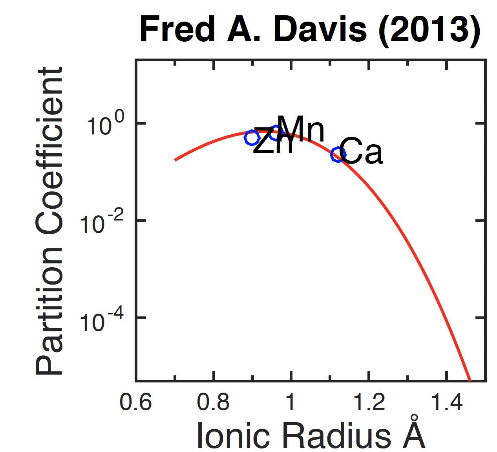
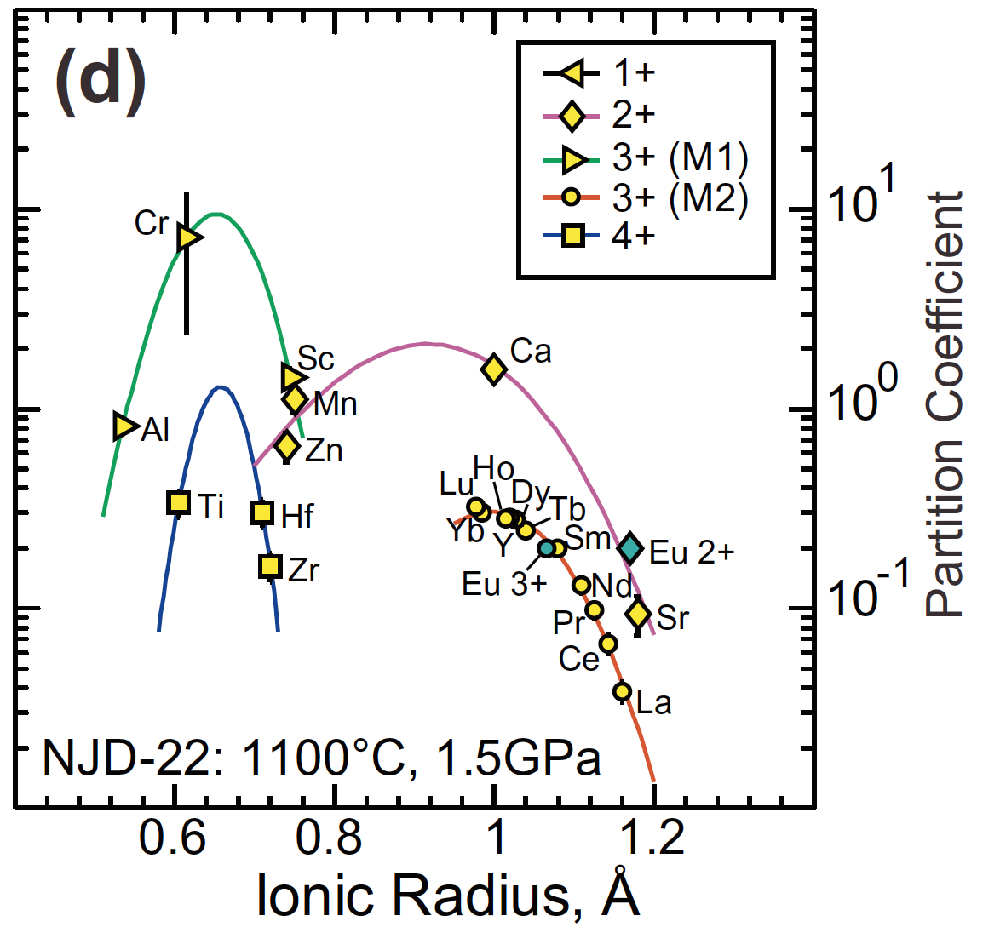

* The data named "Ionic Radius" is mapped to the x axis
* The data named "Partition Coefficient" is mapped to the y axis. The data is continuous with log-transformation
* The data are displayed using both points and lines

I think this plot is “bad” according to Wilke's concept, because the points, lines and characters in the figure overlap to varying degrees, and the range of numbers each axis covers is too large, which interfere with our perception about the relative relationship of the data.

* The data named "Ionic Radius" is mapped to the x axis
* The data named "Partition Coefficient" is mapped to the y axis. The data is continuous with log-transformation
* The data named "Valence" is mapped to color, as well as to shape
* The data are displayed using both points and lines

I think this plot is “good". Even if it contains more information, this plot can more clearly show the relationship and trend between various points. However, the color selection may not be friendly to color blindness and needs to be adjusted. I think this is understandable because the data sets contained in this plot are relatively complex.
