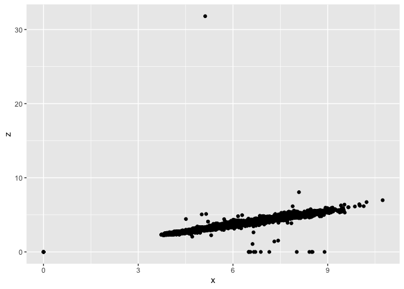
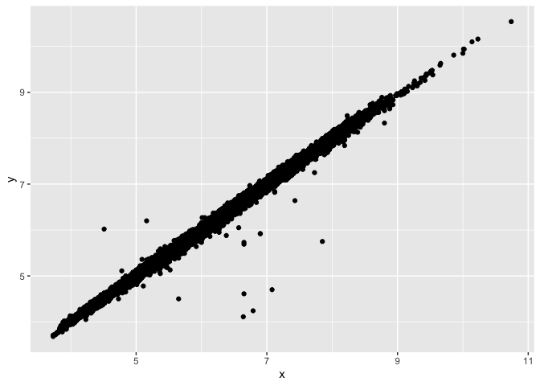
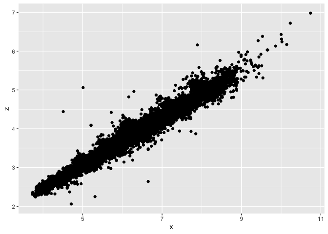

Homework 5
================

\#Part 1

``` r
library(tidyverse)
number_cut <- diamonds %>%
  group_by(cut) %>% #group the data
  summarise(count = n()) #count of diamonds in each “cut” 
(number_cut) #print the data frame
```

    ## # A tibble: 5 × 2
    ##   cut       count
    ##   <ord>     <int>
    ## 1 Fair       1610
    ## 2 Good       4906
    ## 3 Very Good 12082
    ## 4 Premium   13791
    ## 5 Ideal     21551

\#Part 2

``` r
dplyr::sample_frac(diamonds, 0.01, replace = TRUE) #create a data set that contains 1% of the rows
```

    ## # A tibble: 539 × 10
    ##    carat cut       color clarity depth table price     x     y     z
    ##    <dbl> <ord>     <ord> <ord>   <dbl> <dbl> <int> <dbl> <dbl> <dbl>
    ##  1  0.59 Very Good G     VS2      61.5    59  1618  5.32  5.41  3.3 
    ##  2  0.9  Ideal     G     VVS2     61.6    56  6302  6.2   6.23  3.83
    ##  3  1.04 Ideal     D     SI1      61.7    57  5952  6.55  6.51  4.03
    ##  4  1.06 Premium   H     VS2      60.8    59  5205  6.55  6.58  3.99
    ##  5  0.33 Ideal     G     VS1      62.1    56   666  4.4   4.42  2.74
    ##  6  0.36 Premium   E     VS1      61.3    58   852  4.56  4.58  2.8 
    ##  7  0.42 Ideal     G     VVS1     60      57  1235  4.86  4.84  2.91
    ##  8  1.01 Good      G     SI2      63.7    56  4211  6.26  6.34  4.01
    ##  9  0.54 Ideal     F     VVS1     60.8    56  2356  5.28  5.34  3.23
    ## 10  1.26 Premium   D     SI2      61.9    58  5412  6.88  6.81  4.24
    ## # … with 529 more rows

\#Part 3

``` r
clarity_size <- diamonds %>%
  group_by(clarity) %>%
  
 slice_max(order_by = carat, n=100, with_ties = FALSE)%>% #select the 100 largest diamonds in each clarity category
  summarise(average.clarify = mean(carat, na.rm = TRUE)) #calculate the average size
```

\#Part 4

``` r
ggplot(data = diamonds) + 
  geom_point(mapping = aes(x = x, y = y))
```

<!-- -->

``` r
ggplot(data = diamonds) + 
  geom_point(mapping = aes(x = x, y = z))
```

<!-- -->

\#Part 5

``` r
correct_size <- diamonds %>%
  filter (x > 3, y < 20, z > 2 & z < 10) #remove bad points
ggplot(data = correct_size) + 
  geom_point(mapping = aes(x = x, y = y))
```

<!-- -->

``` r
ggplot(data = correct_size) + 
  geom_point(mapping = aes(x = x, y = z))
```

<!-- -->
