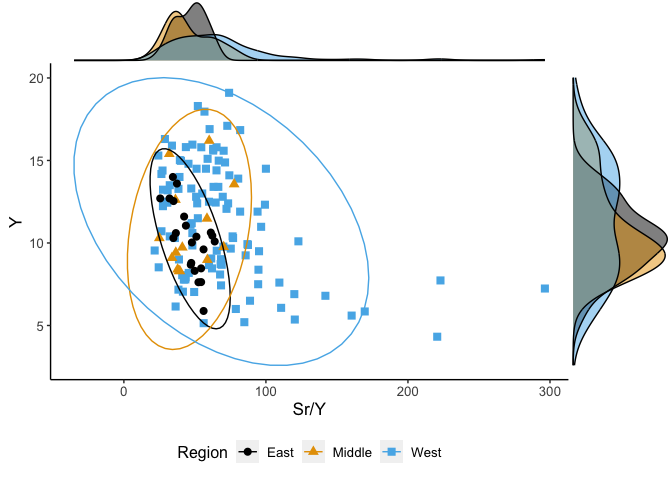

homework 7
================

``` r
library(tidyverse)
major <- read_csv("Major_element.csv")
#view(major)
ggplot(data = major, mapping = aes(x = Sr/Y, y = Y)) + 
  geom_point(mapping = aes(color = Region))+
  geom_smooth(mapping = aes(color = Region)) +
  theme(axis.text.x = element_text( size=5),
        axis.text.y = element_text(size=5),
        axis.title.x = element_text(size=5),
        axis.title.y = element_text(size=5),
        legend.title = element_text(size=5),
        legend.text = element_text(size=5))
```

<!-- -->

This plot is a bad plot. The purpose of this plot is to compare the
relationship between Sr / Y and Y elements of some igneous rock in the
East, Middle and West of Northeast China.

First of all, its color includes red and green, which is very unfriendly
to red-green color blindness (Wilke section 19.3). The axis labels, axis
tick labels, and legend labels are all incredibly small that we can
barely see them (Wilke section 24). Gray background and white grid are
unattractive and do not help to interpret the actual data (Wilke section
23.2). We should also deal with outliers and limit the number of
coordinate axes to a reasonable range. In addition, we are eager to
analyze the distribution trend of geochemical characteristics of rocks
in different regions, but we need to choose a reasonable way to
determine the trend (Wilke section 14.2). This smooth line is not good
for relatively scattered points, which also affects our observation of
the data.

``` r
library(tidyverse)
library(ggExtra)
major <- read_csv("Major_element.csv") %>%
  filter(Y < 20)
 p <- ggplot(data = major, mapping = aes(x = Sr/Y, y = Y)) + 
  geom_point(mapping = aes(color = Region, shape=Region), size=2.5) +
  scale_color_manual(values=c("#000000", "#E69F00", "#56B4E9"))+
  stat_ellipse(aes(x=Sr/Y, y=Y,color=Region),type = "norm")+
   theme(axis.text.x = element_text( size=10),
        axis.text.y = element_text(size=10),
        axis.title.x = element_text(size=13),
        axis.title.y = element_text(size=13),
        legend.title = element_text(size=12),
        legend.text = element_text(size=10),
        legend.position="bottom",
        panel.grid.major = element_blank(), 
        panel.grid.minor = element_blank(),
        panel.background = element_blank(), 
        axis.line = element_line(colour = "black"))
  
  P1 <- ggMarginal(p, type="histogram", groupFill = TRUE)
  print(P1)
```

<!-- -->

This is a good version of the bad plot. First, we change the color of
the points, and each color corresponds to a shape to make them more
friendly to red and green color blindness. In addition, we resized the
labels and points to make them easier to read. We removed an obvious
outlier, as well as a gray background and a white grid. We decided to
use ellipse and histogram to display the distribution range of each
group of points, and the effect is more intuitive.
