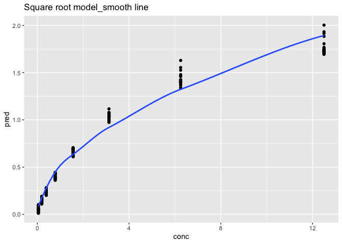

Homework 8
================

# Part 1

``` r
library(tidyverse)
library(gapminder)
```

``` r
d_nest <- diamonds %>%
  group_by(color) %>%
  nest()
# Make a function to create the linear models we want
price_by_weight <- function(df) {
  m <- lm(price ~ carat, data=df)
  m
}

d_nest <- d_nest %>%
  mutate(fit = map(data, price_by_weight))

get_slope <- function(fit_obj) {
  slope <- coef(fit_obj)[2]
  slope
}

d_nest <- d_nest %>%
  mutate(slope = map_dbl(fit, get_slope)) %>%
  arrange(desc(slope))
  (d_nest)
```

    ## # A tibble: 7 × 4
    ## # Groups:   color [7]
    ##   color data                  fit    slope
    ##   <ord> <list>                <list> <dbl>
    ## 1 F     <tibble [9,542 × 9]>  <lm>   8677.
    ## 2 G     <tibble [11,292 × 9]> <lm>   8525.
    ## 3 D     <tibble [6,775 × 9]>  <lm>   8408.
    ## 4 E     <tibble [9,797 × 9]>  <lm>   8296.
    ## 5 I     <tibble [5,422 × 9]>  <lm>   7761.
    ## 6 H     <tibble [8,304 × 9]>  <lm>   7619.
    ## 7 J     <tibble [2,808 × 9]>  <lm>   7094.

# Part 2

``` r
library(modelr)
library(tidyr)
library(nls2)
by_run <- DNase %>% 
  group_by(Run) %>% 
  nest()
nls_mod <- formula(density ~ beta_1 * sqrt(conc) + beta_0)

single_sqrt_model <- function(ssm) {
  nls2(nls_mod, 
  data = ssm, 
  start = list(beta_1 = 0.5, beta_0 = 0.1))
}
by_run <- by_run %>% 
  mutate(model = map(data, single_sqrt_model ))
glance <- by_run %>% 
  mutate(glance = map(model, broom::glance)) %>% 
  unnest(glance)
ggplot(glance, aes(x=Run, y=AIC)) + 
  geom_point() + 
  ggtitle("Square root model")+
 scale_x_discrete(limits=glance$Run)
```

<!-- -->

``` r
by_run_2 <- DNase %>% 
  group_by(Run) %>% 
  nest()
mon_mod <- formula(density ~ beta_3*conc / (beta_4+conc))
monod_model <- function(mm) {
  nls2(mon_mod, 
  data = mm, 
  start = list(beta_3 = 2, beta_4 = 3))
}
by_run_2 <- by_run_2 %>% 
  mutate(model = map(data, monod_model ))

glance <- by_run_2 %>% 
  mutate(glance = map(model, broom::glance)) %>% 
  unnest(glance)
ggplot(glance, aes(x=Run, y=AIC)) + 
  geom_point() + 
  ggtitle("Monod-type model")+
 scale_x_discrete(limits=glance$Run)
```

<!-- -->

It is better to use the monod-type model for this sort of experiment.

# Part 3

``` r
md1 <- DNase
md1 %>% 
ggplot(aes(x=conc, y=density)) + 
  geom_point() 
```

<!-- -->

``` r
nls_mod <- formula(density ~ beta_1 * sqrt(conc) + beta_0)

single_sqrt_model <- nls2(nls_mod, 
                    data = DNase, 
                    start = list(beta_1 = 0.5, beta_0 = 0.1))
 md1 %>% 
  add_predictions(single_sqrt_model) %>% 
  ggplot(aes(conc, pred)) + 
  geom_point(aes(x=conc, y=density)) +
  geom_smooth()+ 
  ggtitle("Square root model_smooth line")
```

<!-- -->

``` r
mon_mod <- formula(density ~ beta_3*conc / (beta_4+conc))
monod_model <- nls2(mon_mod, 
               data = DNase, 
               start = list(beta_3 = 2, beta_4 = 3))
 md1 %>% 
  add_predictions(monod_model) %>% 
  ggplot(aes(conc, pred)) + 
  geom_point(aes(x=conc, y=density)) +
  geom_smooth()+ 
  ggtitle("Monod-type model_smooth line")
```

<!-- -->
